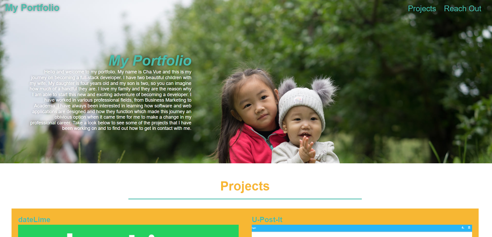

# Portfolio

## Description

This is a website portfolio that hosts the projects I have worked on during my journey to become a full-stack developer. On this page you will find previews of my work and links to the deployed applications. My information is also hosted on this web application so that you can reach me if you have any questions or would like to work with me!

### Tecnologies

This website was devloped using html and css.

### Credits

### Github/Deployed Link

[Github Repo Link](https://github.com/chavue91/portfolio)
[Github Pages Link](https://chavue91.github.io/portfolio/)

## Application Preview

